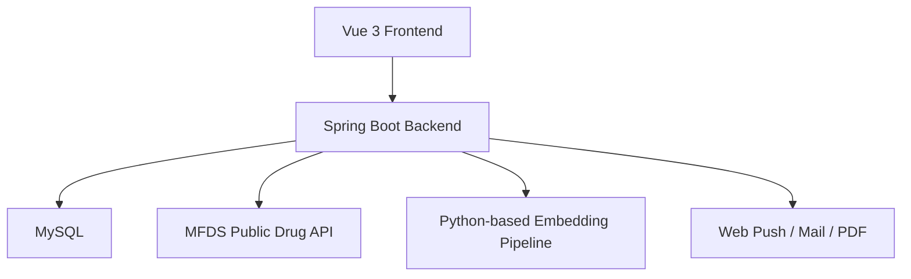

# MEDEAT

> 식단과 복약 데이터를 하나의 흐름으로 연결한 AI 기반 헬스케어 서비스

## Project Summary

`MEDEAT`는 사용자의 식단 기록과 복약 기록을 따로 관리하지 않고, 하나의 건강 데이터 흐름으로 연결해 해석하는 서비스입니다.  
단순 기록 앱이 아니라 `기록 -> 분석 -> 알림 -> 참여 유도 -> 리포트`까지 이어지는 사용자 경험을 만드는 데 초점을 맞췄습니다.

채용 담당자가 이 프로젝트에서 빠르게 파악하면 좋은 포인트는 아래 4가지입니다.

- 식단 관리와 복약 관리를 하나의 서비스 안에서 통합했습니다.
- 공공 의약품 데이터와 이미지 기반 의약품 탐색 기능을 결합했습니다.
- 분석 결과를 끝내지 않고 알림, 챌린지, 커뮤니티, PDF 리포트까지 연결했습니다.
- 프론트와 백엔드를 분리한 구조로 실제 서비스 형태에 가깝게 구현했습니다.

## Why MEDEAT

건강관리 서비스는 보통 식단 기록, 복약 관리, 생활 습관 관리가 각각 분리되어 있습니다.  
`MEDEAT`는 이 단절을 줄이는 데서 출발했습니다.

사용자가 오늘 무엇을 먹었는지, 어떤 약을 복용했는지, 현재 질환 상태와 충돌 위험은 없는지까지 한 화면과 한 흐름에서 이해할 수 있도록 설계했습니다. 여기에 챌린지, 커뮤니티, 알림을 더해 기록이 끊기지 않도록 만드는 것까지 프로젝트 범위에 포함했습니다.

## Main Features

### 1. EAT: 식단 관리와 영양 분석

- 날짜와 식사 시간 기준 식단 기록
- 음식별 영양 정보 합산과 캘린더 조회
- 기간별 식단 분석과 추천 식품 제공
- 분석 결과 PDF 리포트 생성

### 2. MEDI-EAT: 복약 관리와 질환 연계 분석

- 복용 중인 약 등록, 수정, 삭제
- 복약 스케줄 및 당일 복약 로그 관리
- 질환 정보와 식단 기록을 함께 반영한 위험 분석
- 의약품 검색, 상세 조회, 복약 리포트 생성

### 3. MediScan: 의약품 이미지 기반 탐색

- 알약 앞면/뒷면 이미지 업로드
- 이미지 임베딩 유사도 검색
- 각인, 제형, 색상 필터를 조합한 후보 정제
- 공공 의약품 데이터와 연결한 상세 정보 제공

### 4. 참여 유도 기능

- 모드별 챌린지 생성, 참여, 일일 로그 기록
- WebSocket 기반 챌린지 채팅
- 커뮤니티 게시글, 댓글, 좋아요, 스크랩
- XP, 레벨, 스트릭 기반 게이미피케이션

### 5. 알림과 리포트

- 웹 푸시 구독 및 알림 피드
- 복약 시간 기반 스케줄러 알림
- 식단/복약 분석 결과 PDF 다운로드

## User Flow

1. 사용자는 회원가입 후 기본 건강 정보와 복약 정보를 설정합니다.
2. 식단 또는 복약 기록을 남깁니다.
3. 서비스는 누적 데이터를 바탕으로 식단 패턴, 복약 현황, 위험 요소를 분석합니다.
4. 사용자는 챌린지, 커뮤니티, 알림을 통해 기록을 지속합니다.
5. 필요 시 PDF 리포트로 자신의 데이터를 다시 확인합니다.

## Architecture Overview



### Architecture Notes

- `front/`는 Vue 3 + Vite 기반 클라이언트입니다.
- `back/`는 Spring Boot + MyBatis 기반 REST API 서버입니다.
- 의약품 검색은 공공 의약품 API와 내부 캐시 테이블을 함께 사용합니다.
- MediScan 기능은 이미지 임베딩 결과와 의약품 메타데이터를 결합해 후보를 좁히는 구조입니다.

## Repository Structure

```text
MEDEAT/
├─ front/                # Vue 3 + Vite frontend
├─ back/                 # Spring Boot backend
├─ medeat_sql.sql        # DB schema / seed reference
├─ food_db.csv           # nutrition data asset
├─ product_db.csv        # product data asset
└─ final_embedding.json  # pill embedding data asset
```

## Tech Stack

| Area | Stack |
| --- | --- |
| Frontend | Vue 3, Vite, Vue Router, Pinia, Axios, Chart.js |
| Backend | Java 17, Spring Boot 3, Spring Security, MyBatis, MySQL |
| Realtime | WebSocket, STOMP |
| Data / AI | Python-based embedding pipeline, public drug API, embedding assets |
| Output | Web Push, Mail, OpenHTMLtoPDF |
| Collaboration | Git, GitHub |

## Implementation Highlights

- 식단과 복약 데이터를 따로 저장하는 데서 끝나지 않고, 두 도메인을 분석 단계에서 연결했습니다.
- 복약 알림 스케줄러, 챌린지 종료 스케줄러, 알림 피드로 비동기 흐름을 구성했습니다.
- 이미지 유사도 검색만 쓰지 않고 각인, 색상, 제형 정보를 함께 사용해 정확도를 보완했습니다.
- 결과 데이터를 PDF 리포트로 생성해 사용자에게 다시 전달하는 구조까지 구현했습니다.

## Documentation

- [Backend README](./back/README.md)
  - 백엔드 모듈 구조, 인증 방식, 요약 ERD, 실행 환경 변수 정리
- [Frontend README](./front/README.md)
  - 프론트엔드 실행 및 개발 환경 참고
- [Presentation (Release)](https://github.com/SaYoonjin/MEDEAT/releases)

## Quick Start

### Frontend

```bash
cd front
npm install
npm run dev
```

### Backend

```bash
cd back
./mvnw.cmd spring-boot:run
```

세부 환경 변수와 백엔드 구성 설명은 [`back/README.md`](./back/README.md)에서 확인할 수 있습니다.

## Summary

`MEDEAT`는 식단과 복약이라는 두 건강 데이터를 하나의 사용자 경험 안에서 연결하고, 분석 결과를 다시 행동으로 이어지게 만든 프로젝트입니다.  
기록, 분석, 알림, 참여, 리포트까지 이어지는 전체 흐름을 구현했다는 점이 이 프로젝트의 가장 큰 강점입니다.

